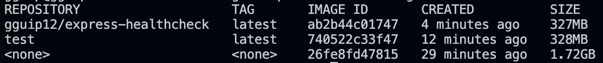
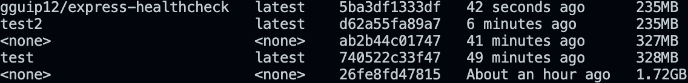
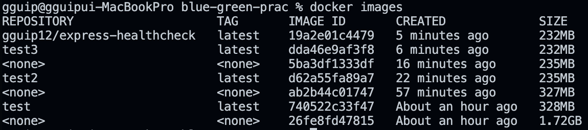

# ✍️ Blue/Green 실습용 레포

이 레포는 Blue/Green 배포 전략을 실습하기 위해 만들어졌습니다. Express.js로 작성된 간단한 헬스체크 API와 Nginx를 사용하여 Blue/Green 배포를 구현합니다.

## 🚧 문제 상황1

- amd64 환경에서만 동작하는 Docker 이미지를 ARM64 환경에서 실행하려고 할 때 호환성 문제가 발생합니다.

## 🛠️ 해결 방법1

- QEMU를 사용하여 ARM64 에뮬레이션을 설정합니다.
- Docker Buildx를 사용하여 다중 아키텍처 이미지를 빌드하고 푸시합니다.
- GitHub Actions 워크플로우를 수정하여 ARM64 환경에서도 빌드 및 배포가 가능하도록 합니다.

## 🚧 문제 상황2

- QEMU, Buildx를 사용하여 multi-arch 이미지를 빌드하는 경우, 레지스트리에 amd64와 arm64 이미지가 각각 저장됩니다. 이로 인해 저장소 용량이 두 배로 증가하는 문제가 발생할 수 있습니다.

## 🛠️ 해결 방법2

- 빌드 시 `--platform` 옵션을 사용하여 특정 아키텍처(예: linux/arm64)만 빌드하고 푸시하도록 설정합니다.

## 🚧 문제 상황3

- Docker 이미지가 너무 커서 추후 ECR에 푸시할 때 Cost 문제가 발생할 수 있습니다.

## 🛠️ 해결 방법3

- 더 작은 베이스 이미지를 사용하여 Docker 이미지 경량화
- Container 내부 Health Check -> Host Health Check로 변경
- Docker Image 1.72GB -> 327MB

  

  

## 🚧 문제 상황4

- Docker 이미지 빌드 시, 불필요한 파일들이 포함되어 이미지 크기가 커지는 문제가 발생합니다.

## 🛠️ 해결 방법4

- Dockerfile 빌드시 불필요한 파일 복사를 방지 및 최적화
- `.dockerignore` 파일에 불필요한 파일 및 디렉토리를 추가합니다.
- Docker Image 327MB -> 235MB

  

  

## 🚧 문제 상황5

- Docker 이미지 멀티 스테이징 방식 미적용으로 인해 빌드 속도가 느려지고, 이미지 크기가 커지는 문제가 발생합니다.

## 🛠️ 해결 방법5

- Dockerfile을 멀티 스테이징 방식으로 이미지 크기 감소
- npm install을 builder 스테이지에서만 실행하여 불필요한 파일 생성 방지
- Docker Image 235MB -> 232MB
  

  

## 🚧 문제 상황6

- Docker Hub -> AWS ECR Private Repository로 변경 중 Github Actions 워크플로우에서 인증 문제 발생
- Github Actions에서 SSH 접속 시 'ubuntu' 유저로 접속하도록 설정되어 있어, ecr-credential-helper가 정상 동작하지 않는 문제 발생

## 🛠️ 해결 방법6

- 'ubuntu' 유저에 /docker/config.json 파일 생성
- ecr-credential-helper가 정상 동작하도록 설정

## 📄 GitHub Actions 워크플로우 추가 수정 사항

- `paths-ignore` 옵션을 사용하여 `./docs/**`, `**.md` 경로의 파일 변경 시 워크플로우가 실행되지 않도록 설정했습니다.
